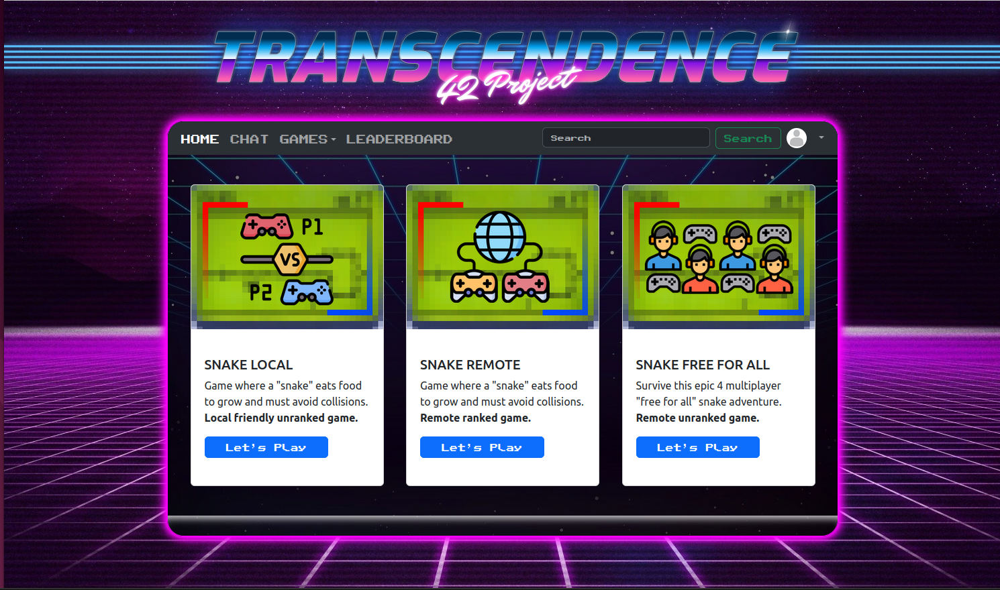

<div id = "42" align = "center">
  
</div>

<br></br>

# Transcendence **🎁 Suprise!**


## Overview
Transcendence is a single-page application (SPA) developed for the 42 school curriculum, delivering a real-time multiplayer gaming platform featuring the classic Pong game and an additional Snake game with local, remote, and free-for-all modes. It includes a leaderboard, a tournament system for Pong, secure authentication via the 42 API with JWT and TOTP-based two-factor authentication (2FA), and a WebSocket-based live chat. The frontend uses vanilla JavaScript and Bootstrap, served via Nginx, while the backend leverages Django with Channels, PostgreSQL, and Redis. The application is deployed using Docker in rootless mode, launched with a single `make` command.

## Features

### Frontend
- **Single-Page Application (SPA)**: Built with vanilla JavaScript and Bootstrap, with modular routing for a responsive interface.
- **Browser History**: Uses the History API for navigation and state persistence.
- **Live Chat**: Real-time chat via WebSocket, supporting public/private messages, game invitations, user blocking, and online user updates.
- **Game Interface**: Retro-styled UI for Pong and Snake with canvas rendering, audio effects, and custom fonts.
- **Leaderboard**: Displays Pong and Snake rankings with profile images, usernames, and points.
- **Tournament**: Supports 4 or 8-player Pong tournaments with a visual bracket and confetti animation for the winner.

### Backend
- **Microservices Architecture**: Four Django services:
  - **user_management**: Handles authentication, profiles, friends, blocking, and match history.
  - **game_server**: Manages server-side logic for Pong and Snake.
  - **chat_server**: Powers WebSocket-based chat with public/private messages and blocking.
  - **matchmaking_server**: Facilitates ranked matchmaking.
- **Django with Channels**: Uses Django for HTTP and Channels with Redis for WebSocket communication.
- **PostgreSQL Database**: Stores user profiles, match history, and chat logs.
- **Server-Side Game Logic**: Pong and Snake handle paddle/snake movement, collisions, and scoring, synchronized via WebSocket.
- **JWT Authentication**: Secure sessions with JWT and 42 API OAuth 2.0.

### Games
- **Pong**:
  - **Local Mode**: Two players on one device, equal paddle speeds, scoring to 10, retro “PONG” logo.
  - **Remote Mode**: Multiplayer via WebSocket, server-driven paddle/ball updates, ranked matches.
  - **Tournament Mode**: Local 4 or 8-player tournaments with a visual bracket, sequential matches, and winner announcement with confetti.
- **Snake**:
  - **Local Mode**: Two players on one device, WASD/arrow key controls, collisions (self, other snake, head-to-head), food collection, unranked.
  - **Remote Mode**: Multiplayer via WebSocket, server-driven snake/food updates, ranked matches.
  - **Free-for-All Mode**: Four players on one device, distinct controls (WASD, arrows, IJKL, Numpad), head-to-head/body collisions (longer snake wins; equal lengths random), grid-based visuals, unranked.
- **Multiplayer and Matchmaking**: Real-time multiplayer with room creation and Redis-based matchmaking. Chat-based invitations.
- **Leaderboard**: Displays top players for Pong and Snake with profile images and ranks.

### Security
- **Password Hashing**: Django’s.
- **Input Validation**: Custom password rules (8+ characters, uppercase, lowercase, number); username/email validation; game input validation.
- **HTTPS/WSS**: Enforced via Nginx and WSS.
- **JWT and 2FA**: Secure sessions with JWT and TOTP-based 2FA with QR codes.

### Deployment
- **Docker in Rootless Mode**: Services run in Docker containers with volumes in `$(HOME)/data`.
- **Single Command**: Run `make` to build and start all services.

## Screenshots
Below are screenshots showcasing the Transcendence interface, games, and features.


<div align= "center">
  
  
</div>
<br>
<div align= "center">
  
  
</div>
<br>
<div align= "center">
  
  
</div>
<br>
<div align= "center">
  
  
</div>


## Modules Implemented
Meets all 7 major modules and 2 minor modules:
1. **Major: Backend Framework (Django)**: Django with Channels and Redis.
2. **Minor: Frontend Toolkit (Bootstrap)**: Responsive UI.
3. **Minor: Database (PostgreSQL)**: PostgreSQL and Redis.
4. **Major: Standard User Management**: Profiles, friends, blocking, match history.
5. **Major: Remote Authentication (42 API)**: OAuth 2.0 with JWT.
6. **Major: Live Chat**: Public/private messages, blocking, invitations.
7. **Major: Add Another Game (Snake)**: Local, remote, and free-for-all modes.
8. **Major: Remote Players**: WebSocket-based multiplayer.
9. **Major: Microservices Architecture**: Four Django services (UserApi, GameServer, ChatServer, MatchmakingServer) plus Nginx.
10. **Major: Two-Factor Authentication**: TOTP-based 2FA.

## Tech Stack
- **Frontend**: Vanilla JavaScript, Bootstrap, Nginx
- **Backend**: Django, Django Channels, Redis
- **Database**: PostgreSQL
- **Real-Time Communication**: WebSockets (Django Channels)
- **Authentication**: JWT, 42 API (OAuth 2.0), TOTP 2FA
- **Deployment**: Docker (rootless), Docker Compose
- **Architecture**: Microservices

## Installation
1. **Clone the Repository**:
   ```bash
   git clone https://github.com/nunotaboada/Transcendence.git
   cd Transcendence
   ```

2. **Run the Application**:
   - Ensure Docker is installed.
   - Run:
     ```bash
     make
     ```
   - Builds and starts all services (frontend, nginx, user_management, game_server, chat_server, matchmaking_server, postgres, redis).

3. **Access the Application**:
   - Open `https://localhost:443` in the browser.

## Usage
- **Login**: Register with email confirmation. Enable 2FA via QR code.
- **Chat**: Send public/private messages, invite players to games, or block users.
- **Games**: Play local or remote Pong/Snake. Join tournaments or view leaderboards.
- **Profile**: Update alias, bio, or profile image; view match history and rankings.

## Project Structure
```
Transcendence/
├── Makefile
└── srcs/
    ├── ChatServer/
    │   ├── chat/
    │   │   ├── consumers.py      # WebSocket chat logic
    │   │   ├── models.py         # Chat data models
    │   │   ├── routing.py        # WebSocket routing
    │   ├── docker-entrypoint.sh
    │   ├── Dockerfile
    │   ├── manage.py
    │   ├── requirements.txt
    │   └── ChatServer/
    │       ├── settings.py       # Django settings
    │       ├── urls.py           # API endpoints
    ├── frontend/
    │   ├── conf/
    │   │   └── default.conf      # Nginx configuration
    │   ├── www/
    │   │   ├── css/              # Bootstrap and custom styles
    │   │   ├── js/
    │   │   │   ├── aut/api42.js  # 42 API OAuth
    │   │   │   ├── chat/chat_socket.js  # WebSocket chat
    │   │   │   ├── games/pong-local.js  # Local Pong
    │   │   │   ├── games/pong-remote.js  # Remote Pong
    │   │   │   ├── games/pong-tournament.js  # Tournament Pong match
    │   │   │   ├── games/pong-tournament-bracket.js  # Tournament bracket
    │   │   │   ├── games/snake-local.js  # Local Snake
    │   │   │   ├── games/snake-remote.js  # Remote Snake
    │   │   │   ├── games/snake-free-for-all.js  # Snake Free-for-All
    │   │   │   ├── games/pong-options.js  # Pong game mode selection
    │   │   │   ├── games/snake-options.js  # Snake game mode selection
    │   │   │   ├── games/pong-pages.js  # Pong game pages
    │   │   │   ├── games/snake-pages.js  # Snake game pages
    │   │   │   ├── games/leaderboard.js  # Leaderboard
    │   │   │   ├── 2faQrcode/2fa_qrcode.js  # 2FA QR code
    │   │   ├── index.html        # SPA entry point
    │   │   ├── files/            # Images and assets
    │   ├── Dockerfile
    ├── GameServer/
    │   ├── pong_app/
    │   │   ├── ponggame.py       # Pong game logic
    │   │   ├── consumers.py      # WebSocket game updates
    │   ├── snake_app/
    │   │   ├── snakegame.py      # Snake game logic
    │   │   ├── consumers.py      # WebSocket game updates
    │   ├── room_gen_app/
    │   │   ├── models.py         # Game room models
    │   ├── docker-entrypoint.sh
    │   ├── Dockerfile
    │   ├── manage.py
    │   ├── requirements.txt
    │   └── GameServer/
    │       ├── settings.py       # Django settings
    │       ├── urls.py           # API endpoints
    ├── MatchmakingServer/
    │   ├── matchmaking/
    │   │   ├── matchmaking.py    # Matchmaking logic
    │   │   ├── consumers.py      # WebSocket matchmaking
    │   ├── docker-entrypoint.sh
    │   ├── Dockerfile
    │   ├── manage.py
    │   ├── requirements.txt
    │   └── MatchmakingServer/
    │       ├── settings.py       # Django settings
    │       ├── urls.py           # API endpoints
    ├── nginx/
    │   ├── conf/
    │   │   └── default.conf      # Nginx configuration
    │   ├── docker-entrypoint.sh
    │   ├── Dockerfile
    ├── postgres/
    │   ├── Dockerfile
    ├── UserApi/
    │   ├── user_app/
    │   │   ├── models.py         # User models with 2FA
    │   │   ├── validators.py     # Input validation
    │   │   ├── serializers.py    # API serialization
    │   │   ├── views.py          # API views
    │   ├── docker-entrypoint.sh
    │   ├── Dockerfile
    │   ├── manage.py
    │   ├── requirements.txt
    │   └── UserApi/
    │       ├── settings.py       # Django settings
    │       ├── urls.py           # API endpoints
    └── docker-compose.yml
```

## Authors
- **Names**: Nuno Taboada, [Heitor Maciel](https://github.com/HeitorMP), [Ivo Marques](https://github.com/Pastilhex), [José Moreira](https://github.com/zeira42), [João Almeida](https://github.com/jpalmeidaalves)
- **Email**: nunotaboada@gmail.com

This project was completed as part of the 42 school curriculum

<a href="https://www.42porto.com/pt/">
 		
</a>
